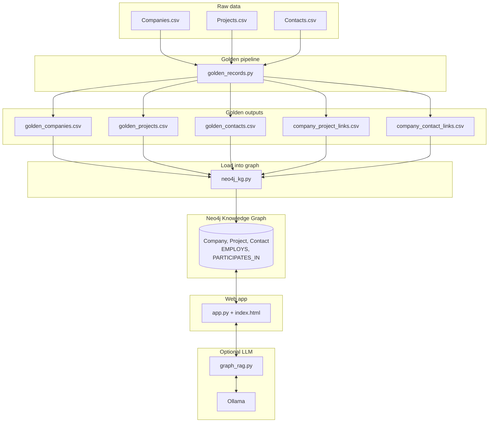
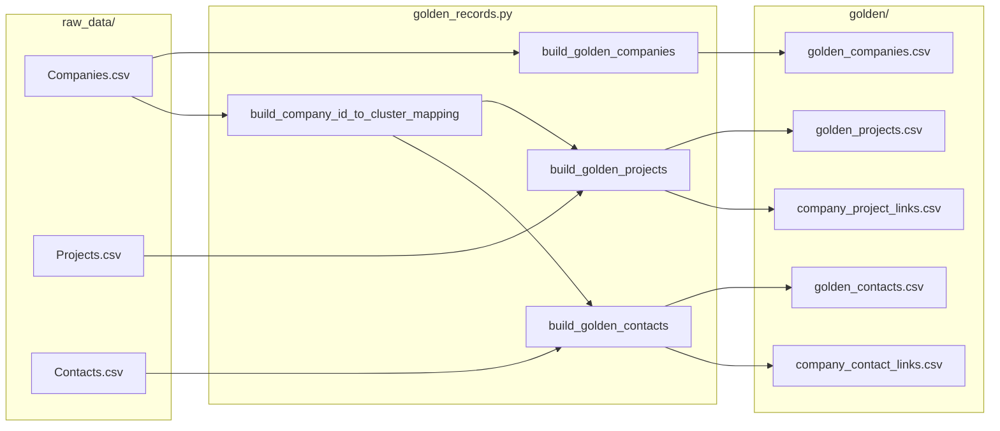
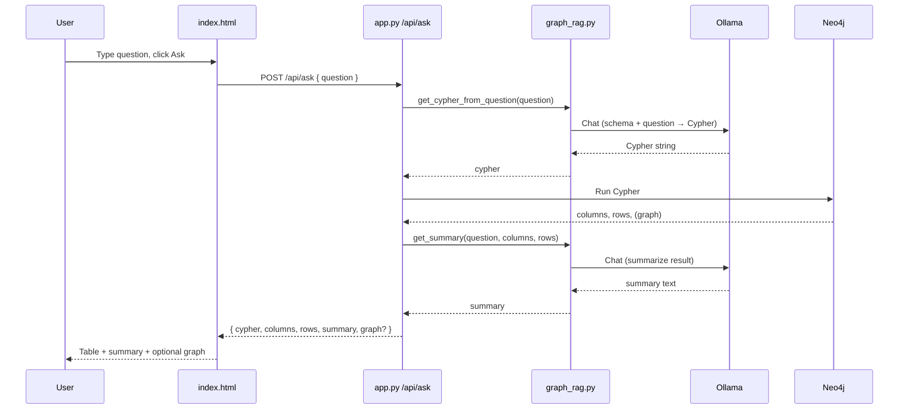
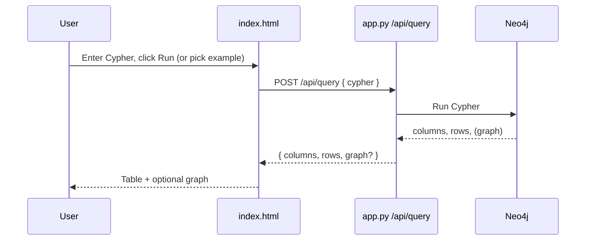
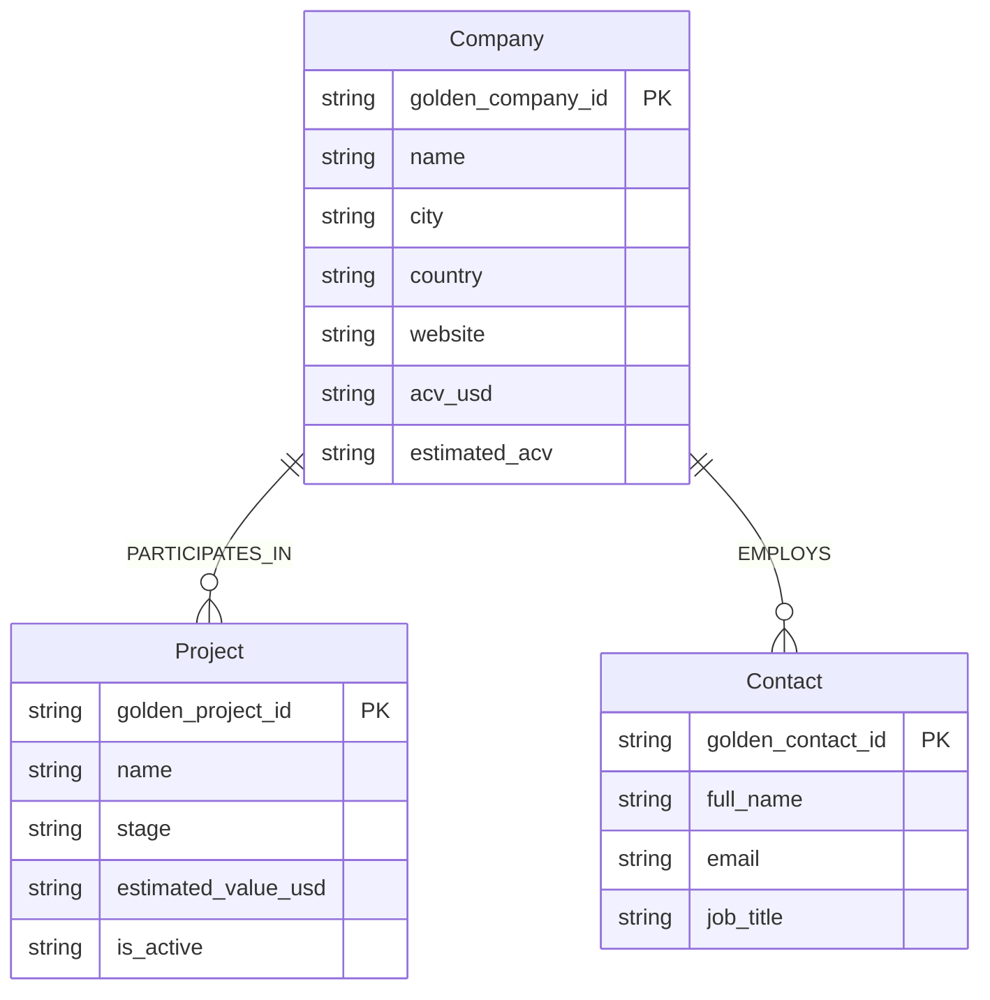

# Golden Data — Design Flow

This document describes the end-to-end design and data flow so developers can understand how the system works.

---

## 1. High-level architecture

**Summary:** Raw CSVs → **golden_records.py** → Golden CSVs + link tables → **neo4j_kg.py** → Neo4j. The **Flask app** queries Neo4j (direct Cypher or via **graph_rag.py** + Ollama for natural language).

---

## 2. Data pipeline flow (offline)

**Steps:**

1. **Companies** → One golden company per cluster (`DEDUP_PARENT_ID`). Canonical row preferred; merge non-null from cluster. All raw columns kept; `ESTIMATED_ACV` etc. merged.
2. **Mapping** → `company_id_src` / `company_source_id` → `company_cluster_id`.
3. **Projects** → One row per project; `company_cluster_id` from mapping. All raw columns kept.
4. **Contacts** → One row per contact; `company_cluster_id` from `COMPANY_SOURCE_ID`. All raw columns kept.
5. **Links** → `company_project_links.csv` and `company_contact_links.csv` for Neo4j relationships.

**Commands:**  
`python golden_records.py` → writes `golden/`.  
`python neo4j_kg.py` → reads `golden/`, loads into Neo4j.

---

## 3. Runtime flow: how a query is answered

Two ways the user can query: **Ask (natural language)** and **Run Cypher**.

### 3a. Ask (natural language)

- **graph_rag.py** turns the question into read-only Cypher using the graph schema and an example, then (optionally) summarizes the result via Ollama.
- **app.py** runs the Cypher on Neo4j and returns table + summary + optional graph for the UI.

### 3b. Run Cypher (direct)

- No LLM. **app.py** executes the Cypher and returns the result.

---

## 4. Component map

| Component | Role |
|-----------|------|
| **config.py** | Paths (raw_data, golden), Neo4j URI/user/password, Ollama host/model. |
| **golden_records.py** | Build golden companies/projects/contacts and link tables from raw CSVs. |
| **neo4j_kg.py** | Load golden CSVs into Neo4j: Company, Project, Contact nodes; PARTICIPATES_IN, EMPLOYS edges. |
| **graph_rag.py** | Text→Cypher (Ollama + schema + example); result→summary (Ollama). Validates read-only Cypher. |
| **app.py** | Flask: serves index.html, /api/status, /api/examples, /api/query, /api/ask, /api/ollama-status, /api/graph. |
| **index.html** | UI: Ask input, Cypher editor, examples dropdown, results table, graph tab, status. |
| **static/images/** | Platform logo placeholder, construction hero image. |

---

## 5. Graph model (Neo4j)

- **Company** and **Project** are linked by **PARTICIPATES_IN** (from `company_project_links.csv`).
- **Company** and **Contact** are linked by **EMPLOYS** (from `company_contact_links.csv`).

---

## 6. Quick reference: run order

1. **One-time / when raw data or golden logic changes**  
   `python golden_records.py`  
   → Produces `golden/*.csv`.

2. **Load or reload the graph**  
   `python neo4j_kg.py`  
   → Clears and reloads Neo4j from `golden/`.

3. **Run the app**  
   `python app.py` or `flask --app app run`  
   → Open the UI, use Ask or Cypher.

4. **Optional (for Ask)**  
   Install and run Ollama; pull a model (e.g. `ollama pull llama3.2`).  
   If Ollama is not running, the app still works with direct Cypher and example queries.
